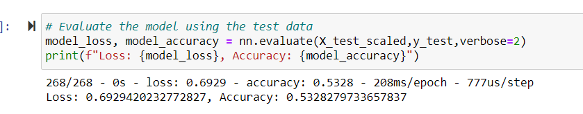

# Neural Network Charity Analysis

## Overview of the Charity Analysis
Alphabet Soup is a a non-profit dedicated to helping organizations that protect the environment, improve people's well-being, and unify the world. 

This project aims to assist Alphabet Soup in predicting which organizations to lend money to, and which organizations are too high-risk. Due to the complex nature of the data, a deep learning neural network was used to evaluate all types of input data and make a clear, data-driven result.  

## Results 
#### Data Preproccessing
* What variable(s) are considered the target(s) for your model?

The accuracy was the main target in the model. The goal was to acheive at least 75% accuracy.

* What variable(s) are considered to be the features for your model?

The variables considered to be the features in the model include APPLICATION_TYPE, CLASSIFICATION, STATUS, and IS_SUCCESSFUL. 

* What variable(s) are neither targets nor features, and should be removed from the input data?

The EINs and the name of the individual companies (the NAME column) have been removed because there are too many unique data values in those columns that do not provide any useful value to the findings.

#### Compiling, Training, and Evaluating the Model
* How many neurons, layers, and activation functions did you select for your neural network model, and why?

The number of neurons were left unchanged. A third layer was added using the sigmoid function. The other two layers were left as relu. This was done because originally there were only two hidden layers, and the final accuracy was 52%. By adding a third layer and changing it to sigmoid, the accuracy is now 53%, a slight increase from before.

* Were you able to achieve the target model performance?

The target model performance was at least 75% accuracy, and this model reached 53%. The target model performance was not achieved.

* What steps did you take to try and increase model performance?

In addition to the third hidden layer, ten more epochs were added, for a total of 30 epochs.

#### Figure 1: *Final Accuracy of Model*
  

## Summary
This model was not as successful as it should have been. With only a 53% accuracy, one should not rely on it too much. Perhaps one way to improve this model would be to include more data for the model to use, thereby making it more accurate. 